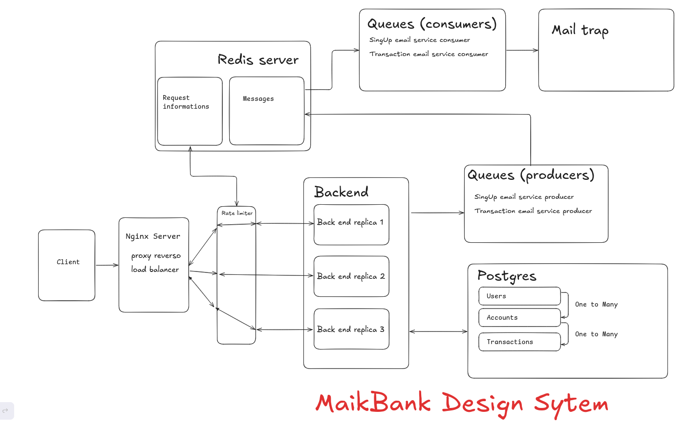
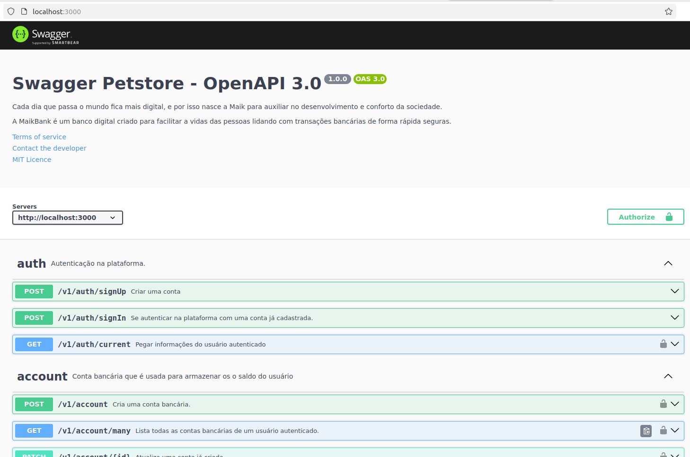
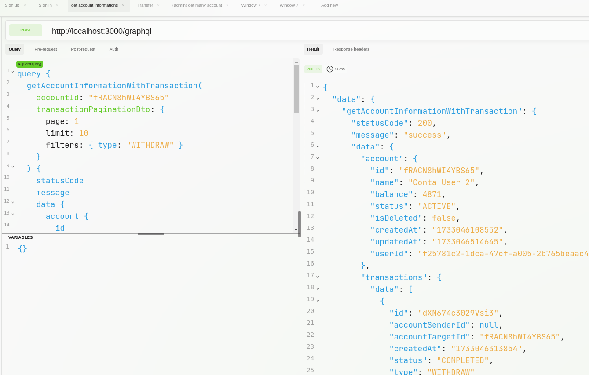

# MaikBank backend
Cada dia que passa o mundo fica mais digital, e por isso nasce a Maik para auxiliar no desenvolvimento e conforto da sociedade.

A MaikBank é um banco digital criado para facilitar a vidas das pessoas lidando com transações bancárias de forma rápida seguras.

Antes de começar, verifique se você tem os seguintes pré-requisitos instalados:

## Design system da aplicação


Esse design system é se caso for rodar a aplicação usando o docker usando o docker compose.

Ele está com **nginx** trabalhando como proxy reverso e load balancer escutando em localhost na porta 8080 ou na porta 80.


## Requisitos Opcionais
O docker é um requisito opcional, mas que dou preferência que use para facilitar para rodar a aplicação e também de gerenciar os processos.

Como requisitos de não usar o docker, é nescessário que tenho o node > 18, redis, postgres instalados no seu sistema operacional.


Instalando o docker:

- [Docker](https://www.docker.com/get-started)
- [Docker Compose](https://docs.docker.com/compose/install/)

!!! **Aviso**: Se você nunca utilizou o docker ou uma máquina virtual no seu computador, provavelmente você terá que habilitar na bios a virtualização do processador, tanto para quem utiliza o windows quanto o linux.

#### observações
Windows: Você pode instalar o docker com o docker compose instalando somente o docker desktop, mas antes é nescessário instalar o wsl2 no seus sistema operacional
- [Wsl2](https://learn.microsoft.com/pt-br/windows/wsl/install)

Linux: Se você já tem a virtualização do processador habilitado, você já pode instalar rodando os comandos na página oficial do docker.
Um dica para não ter que ficar usando sudo, rode esse comando no terminal após instalar o docker.

```terminal
 sudo chown "$USER":"$USER" /home/"$USER"/.docker -R

 sudo chmod g+rwx "$HOME/.docker" -R
```

Em caso de dificuldade ao instalar ou executar o projeto, pode entar em contato comigo.

### Configurando as variávies de ambiente
Se você vai rodar de forma local sem o docker, é nescessário que crie na **raiz** do projeto um arquivo chamado ***.env***, caso venha utilizar o docker crie um arquivo chamado ***docker.env*** posteriormente eu explico a diferença.

## Estrutura dos arquivos env e .docker.env:
### .env
```env
# Security
JWT_SECRET="5c3bc483b9e49e859f3f0416c4be1d4c71fe0336ea07d321d16713e43dcaf10b5c3bc483b9e49e859f3f0416c4be1d4c71fe0336ea07d321d16713e43dcaf10b5c3bc483b9e49e859f3f0416c4be1d4c71fe0336ea07d321d16713e43dcaf10b"

# Postgres
POSTGRES_HOST="localhost"
POSTGRES_PORT=5432
POSTGRES_DB="db"
POSTGRES_USER="user"
POSTGRES_PASSWORD="pass"
DATABASE_LOG=false

# Redis
REDIS_HOST="localhost"
REDIS_PORT=6379
REDIS_PASSWORD="pass"

# Admin
ADMIN_EMAIL="admin@gmail.com"
ADMIN_PASSWORD="@#Adminpassword123"

# Bakend Config
BACKEND_BASE_URL=http://localhost:
BACKEND_PORT=3000
ALLOW_CORS_URL=http://localhost:3001

# Node Mailer (Use o serviço do Mailtrap)
# https://mailtrap.io/
NODE_MAILER_HOST=
NODE_MAILER_PORT=
NODE_MAILER_USER=
NODE_MAILER_PASSWORD=
```

essa é a estrutura par o arquivo **.env**, já o do **.docker.env** é a mesma, a diferença que o arquivo docker-compose.yml cria uma rede interna onde as apliações vão se comunicar através de containers e não do sistema oparacional (localhost). Por isso, nas credenciais do banco, onde está localhost tem que passar o nome do container (serviço).

### .docker.env.
```env
JWT_SECRET="5c3bc483b9e49e859f3f0416c4be1d4c71fe0336ea07d321d16713e43dcaf10b5c3bc483b9e49e859f3f0416c4be1d4c71fe0336ea07d321d16713e43dcaf10b5c3bc483b9e49e859f3f0416c4be1d4c71fe0336ea07d321d16713e43dcaf10b"

POSTGRES_HOST="maik-bank-pg-server"
POSTGRES_PORT=5432
POSTGRES_DB="db"
POSTGRES_USER="user"
POSTGRES_PASSWORD="pass"
DATABASE_LOG=false

REDIS_HOST="maik-bank-redis-server"
REDIS_PORT=6379
REDIS_PASSWORD="pass"

ADMIN_EMAIL="admin@gmail.com"
ADMIN_PASSWORD="#@Adminpassword123"

BACKEND_BASE_URL=http://localhost:
BACKEND_PORT=3000

NODE_MAILER_HOST=
NODE_MAILER_PORT=
NODE_MAILER_USER=
NODE_MAILER_PASSWORD=
```

<div style="border: 2px solid red; padding: 10px; background-color: #f8d7da; color: #721c24; border-radius: 5px;">
  <strong>Aviso:</strong> Mesmo que você utilize o docker, não precisa delclarar nele as variáveis de ambiente porque eu o já coloquei para carregar as variáveis de ambiente automaticamente :)
</div>


## Rodando as migrations
Antes de executar o projeto, é nescessário que execute as migrations para criar as tabelas no banco de dados.

Se você for rodar de forma **local** use o comando:
```terminal
npm rum migration:run
```

Mas caso use o **doker**, não precisa, já que ele vai rodar os comandos descritos no arquivo [entrypoint.sh](./entrypoint.sh) que vai rodar as migrations automaticamente :-)

## Instalando as dependências
Se vai utilizar de forma **local** instale as dependências do node utilizando o comando:

```terminal
npm install
```
Se vai utilizar o **docker** não precisa rodar esse comando.

## Rodando a aplicação.
Para rodar aplicação, use o comando:

### local
primeiro faça a build do projeto:
```terminal
npm run build
```
de depois execute o projeto:
```terminal
npm run start
```

### Acessando a documentação
A documentação do swagger está no endpoint raiz do projeto **/**


Já a do Graphql está na endpoins **/graphql**


## Dica
Eu costumo utilizar o [Altair Client](https://www.google.com/url?sa=t&source=web&rct=j&opi=89978449&url=https://altairgraphql.dev/&ved=2ahUKEwiEh_2et4eKAxVFp5UCHTfQOagQFnoECCcQAQ&usg=AOvVaw32ZbsmgN8P9yc4SiJ6Y8MG) para fazer as requisições graphql, mas é possível utilizar o playground do appolo server normalmente

<div style="border: 2px solid red; padding: 10px; background-color: #f8d7da; color: #721c24; border-radius: 5px;">
  <strong>Aviso:</strong> Até o momento, não está sendo possível instalar o Altair client pelo site pois não está carregando. Mas você pode instalalo ele no linux com comandos.
</div>


## Os clients não baixa Pdfs
Essa api tem recurso de gerar PDFs de transações sendo exeplicado na doc da api, mas como a maioria dos clients não tem a capacidade de baixar o arquivo, você pode testar rodando o curl:

```terminal
curl -X GET http://localhost:3000/v1/transaction/voucher/{transactionId} \
-H "{Authorization: Bearer <token....>} \
-o nome-do-arquivo.pdf
```

se você precisar utilizar código, pode utilizar ess função para salvar o arquivo:
```js
const fetch = require('node-fetch');
const fs = require('fs');

fetch('http://localhost:3000/v1/transaction/voucher/{transactionId}', {
  headers: { 'Authorization': 'Bearer <token_aqui>' }
})
  .then(res => res.buffer())
  .then(data => fs.writeFileSync('nome-do-arquivo.pdf', data))
  .catch(console.error);
```

## Detalhes
## Acesso de administrador
O usuáro admin tem três etapas de cadastro e acesso do admin:
 - A primeira é passando o email e a senha que ele vai usar nas variáveis de ambiente.
```env
...
ADMIN_EMAIL="admin@gmail.com"
ADMIN_PASSWORD="#@Adminpassword123"
...
```
 - A segunda é, cadastrando ele na plataforma seja uando rest api ou com o graphql como está descrito no swagger para o rest e no playground do apollo client para o graphql. Após o cadastro, API vai retornar o token jwt, mas, ele não vai ser válido pois não tem no payload a role de ADMIN.

 - O passo final consiste em ir no método de login, e se autenticar com dos dados do admin fornecido no arquivo env.

<div style="border: 2px solid red; padding: 10px; background-color: #f8d7da; color: #721c24; border-radius: 5px;">
  <strong>Aviso:</strong> Você pode cadastrar o admin na api com a senha que quiser, mas elá não vai ser usada pois a senha váilida é a que foi preenchida no arquivo env.

  <strong>Aviso: </strong> A role do admin não muda no banco de dados, ela muda apénas na geração do token, mesmo que retorne no método de signIn a role como USER, no payload do JWT ele vai estar como ADMIN.
</div>

### Filtros e paginação.
Eu adicionei filtros e paginação para os recursos que vão retornar como retornar como lista.

O formato para fazer a requisição são por exemplo para **rest**:
```
http://localhost:8080/resource?page=1&limit=100&order=DESC&filters[perpertie1]=value&filters[perpertie2]=value&filters[perpertie3]=value
```
já para o **graphql** é passado como um objeto no parâmetro data função.

```graphql
paginationDto: {
    limit: 1,
    page: 100,
    order: "DESC", #ASC
    filters: {
      propertie1: value
      propertie2: value
      propertie3: value
            .
            .
            .
    }
```

as propriedades são as propriedades da entidade das quais desejam ser filtradas.


